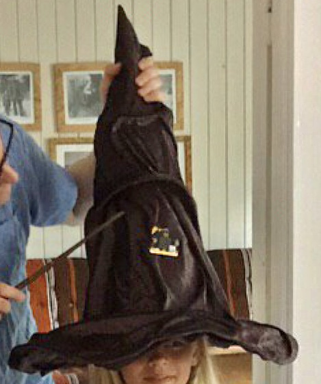

# Readme
This repo contains micro:bit code, made for a Harry Potter theme party, that simulates the Sorting Hat and arranges the table seating.

## Background
At Harry Potter's school (_Hogwarts School of Witchcraft and Wizardry_), all new first year students must be sorted into the four Houses called _Gryffindor_ (G), _Hufflepuff_ (H), _Ravenclaw_ (R), and _Slytherin_ (S). This is done at a ceremony, where the sorting hat is placed on each student's head. The sorting hat then determines what house the student belongs to, and the student can go to join the table for the chosen house.

At your Harry Potter-themed party, you could divide your guests into houses in a similar ceremony, using a micro:bit sewn onto your sorting hat. With four tables, one for each house, this ceremony will arrange the seating around the tables. A micro:bit can make these choices by generating random (and of course magic) numbers, but it should never assign more guests to a table, than the maximum number of chairs at that table.

Picture of a micro:bit-powered sorting hat in action at a birthday party. Tapping the hat with a wand was enough to give the micro:bit a 'shake' signal.

## Operation
When your guests have arrived and you know how many came, then you decide how many seats you want to place around each table. You give the numbers of seats to the micro:bit before the ceremony. This initialization is done using buttons, that is, not by changing the code. During the ceremony, the micro:bit then fills up exactly the available seats.

The sorting hat code uses the buttons **A** and **B** and it uses the **shake** input. Like a digital watch from the 1980s, the function of the buttons depends on which **mode** the sorting hat is in. It has a "settings" mode and a "ceremony" mode.

- While in **"settings"** mode: 
  - The **A** button cycles through the four tables: G -> S -> H -> R -> G etc, and displays the current table.
  - The **B** button adds a seat to the current table and displays the table's number of seats.
  - The **A+B** button toggles to the "ceremony" mode and displays a triangle (hat-shaped).
- While in **"ceremony"** mode:
  - The **shake** first displays a processing icon (while the sorting hat is "thinking"), and then displays a choice of next table.
  - The **A** button displays again the last choice made.
  - The **B** button displays the series of choices made so far (the whole history).
  - The **A+B** button toggles back to the "settings" mode and displays a rectangle (table-shaped).

## Files
- The code/microbit-Sortinghat4.hex file is the code you can download to a microbit. Or you kan edit and simulate the code at (https://makecode.microbit.org)
- The doc/microbit-Sortinghat4.js and doc/microbit-Sortinghat4.py files are translations of the .hex code, included here for documentation.
- This Readme file
- An MIT license
